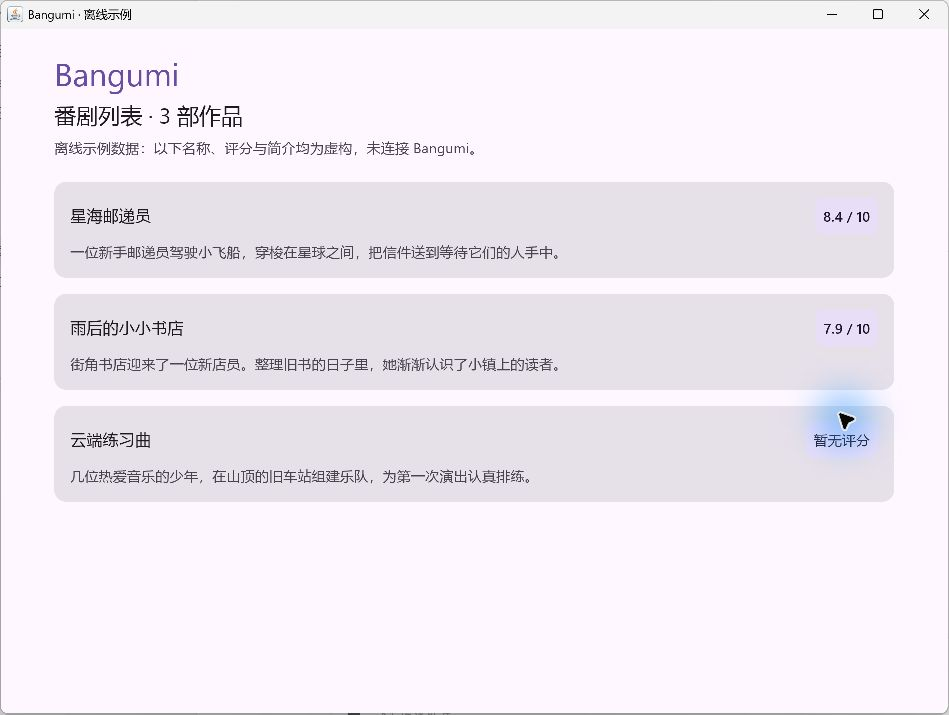

# BG-001 首个离线窗口：从哪里读、怎样运行

这份说明面向有 Java 基础、没有完整项目开发经验的学习者，对应目标 `BG-001 首个离线窗口`：打开一个 Windows 窗口，显示 3 条示例番剧。名称、评分和简介均为虚构数据。

实际构建、启动和界面检查结果以 [PROGRESS.md](PROGRESS.md) 为准。

下面是本项目实际运行后的窗口：



## 先运行起来

打开 PowerShell，执行下面两行：

```powershell
cd D:\Projects\workspace\bangumi
.\gradlew.bat :composeApp:run
```

第一行进入项目根目录，第二行启动应用。看到窗口后，终端会继续等待；关闭窗口后，这条命令才会结束。

第一次运行需要联网下载构建工具和依赖，耗时会比之后长。当前工程使用 JDK 17；运行 `java -version` 可以查看 Java 版本。

这条命令可以分成两部分理解：

- `gradlew.bat`：项目自带的 Gradle Wrapper 脚本，负责使用项目指定的 Gradle 版本。
- `:composeApp:run`：让 Gradle 执行 `composeApp` 模块的 `run` 任务，也就是启动应用。

“模块”是项目中一组相关代码和构建配置。本项目目前只有一个应用模块 `composeApp`。

## 先认识这几个文件

建议按表格顺序阅读，不必一开始就理解所有 Gradle 配置。

| 文件 | 负责什么 |
| --- | --- |
| [Subject.kt](../composeApp/src/commonMain/kotlin/dev/bangumi/demo/model/Subject.kt) | 定义一部番剧包含哪些字段 |
| [SampleSubjects.kt](../composeApp/src/commonMain/kotlin/dev/bangumi/demo/data/SampleSubjects.kt) | 创建 3 条示例数据 |
| [Main.kt](../composeApp/src/desktopMain/kotlin/dev/bangumi/demo/Main.kt) | 程序入口，打开窗口并把数据交给界面 |
| [App.kt](../composeApp/src/commonMain/kotlin/dev/bangumi/demo/ui/App.kt) | 应用共享界面入口，应用统一主题 |
| [SubjectListScreen.kt](../composeApp/src/commonMain/kotlin/dev/bangumi/demo/ui/screens/SubjectListScreen.kt) | 显示页面标题和番剧列表 |
| [SubjectCard.kt](../composeApp/src/commonMain/kotlin/dev/bangumi/demo/ui/components/SubjectCard.kt) | 显示一部番剧的名称、评分和简介 |
| [BangumiTheme.kt](../composeApp/src/commonMain/kotlin/dev/bangumi/demo/ui/theme/BangumiTheme.kt) | 统一主题和常用间距 |

数据经过的路径是：`sampleSubjects` → `Main` → `App` → `SubjectListScreen` → `SubjectCard`。

`commonMain` 保存未来可供其他平台复用的代码；`desktopMain` 保存桌面程序入口及 JVM 专用代码。目前只配置了桌面目标。

## 把 Kotlin 对照成 Java

### 1. 数据类和只读属性

```kotlin
data class Subject(
    val id: Int,
    val name: String,
    val score: Double?,
    val summary: String,
)
```

可以把它理解成一个 Java 数据类：有构造方法、字段的 getter，以及自动生成的 `equals()`、`hashCode()`、`toString()`。

- `val name: String`：这里类似 Java 的 `private final String name` 加 getter。Kotlin 把类型写在名称后面。
- `val` 表示这个属性不能重新赋值，类似 Java 的 `final`；它不会自动让引用指向的所有对象都不可变。
- `Double?` 表示评分可以为 `null`。Java 的包装类型 `Double` 也允许 `null`，Kotlin 则会要求代码显式处理可能为空的情况。
- 读取 `subject.name`，可以类比调用 Java 的 `subject.getName()`。

### 2. 创建对象和列表

```kotlin
Subject(
    id = 1,
    name = "星海邮递员",
    score = 8.4,
    summary = "一位新手邮递员的星际旅程。",
)
```

Java 创建对象会写 `new Subject(...)`，Kotlin 直接写 `Subject(...)`。`name = ...` 这种写法叫命名参数，让你能直接看到每个值传给哪个字段。

`listOf(...)` 把几个对象放进列表。`List<Subject>` 和 Java 的泛型列表写法很接近；这里使用 Kotlin 的只读列表接口，当前页面只读取它。

### 3. 函数与程序入口

`fun` 用来声明函数。Kotlin 可以把函数直接写在文件里，因此 [Main.kt](../composeApp/src/desktopMain/kotlin/dev/bangumi/demo/Main.kt) 不需要先声明一个 `Main` 类。

文件中的 `main()` 对应 Java 的 `public static void main(String[] args)`。编译到 JVM 时，本例入口归在 `dev.bangumi.demo.MainKt` 中，构建配置已经指定它。

`application { ... }` 中的大括号是一段传给 `application` 的代码，可以对照 Java 的 Lambda 来理解。Kotlin 允许把最后一个函数类型参数写在圆括号外，叫尾随 Lambda。

`onCloseRequest = ::exitApplication` 表示“关闭窗口时，执行退出应用的函数”。`::exitApplication` 是函数引用，类似 Java 的方法引用。

### 4. 界面函数

`@Composable` 是 Compose 用来识别界面函数的注解。可以先读成：“这个函数描述一块界面。”

- `Column { ... }` 把内容从上到下排列。
- `Row { ... }` 把内容从左到右排列。
- `Text(...)` 显示文字。
- `LazyColumn` 显示可以滚动的列表，按需要创建可见条目的界面。
- `Modifier` 用来设置尺寸、间距等界面属性。
- `dp` 是适应屏幕缩放的界面尺寸单位；本例的常用间距集中放在主题文件中。

在 [SubjectCard.kt](../composeApp/src/commonMain/kotlin/dev/bangumi/demo/ui/components/SubjectCard.kt) 中：

```kotlin
text = if (subject.score == null) "暂无评分" else "${subject.score} / 10"
```

Kotlin 的 `if` 可以产生一个值，类似 Java 的 `条件 ? 值一 : 值二`。`${subject.score}` 是字符串模板，用来把评分放进文字里。

## 可选的小改动

把 [SampleSubjects.kt](../composeApp/src/commonMain/kotlin/dev/bangumi/demo/data/SampleSubjects.kt) 中第一部作品的名称改成自己喜欢的名字，保存文件，关闭旧窗口，再运行启动命令。

验证方式：窗口里的第一部作品名称应随之变化。这份工程没有配置自动热更新，所以保存文件后需要重新启动。

练习不会阻止继续开发。本文截图与基础讲解保留 BG-001 阶段；当前版本已加入搜索框，输入、状态和事件的说明见 [BG-002 学习说明](BG-002.md)，最新状态见 [进度索引](PROGRESS.md)。
